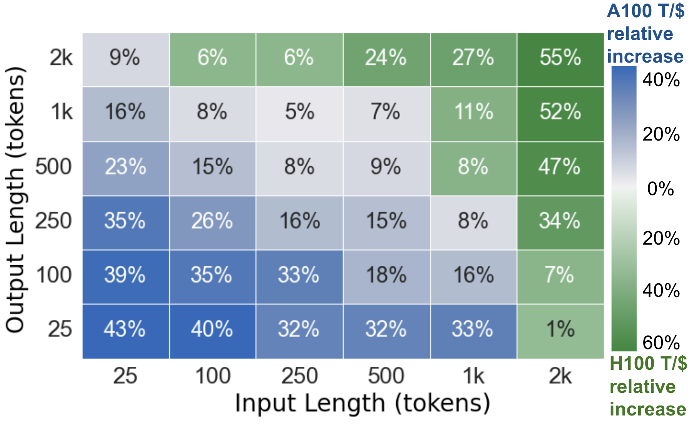
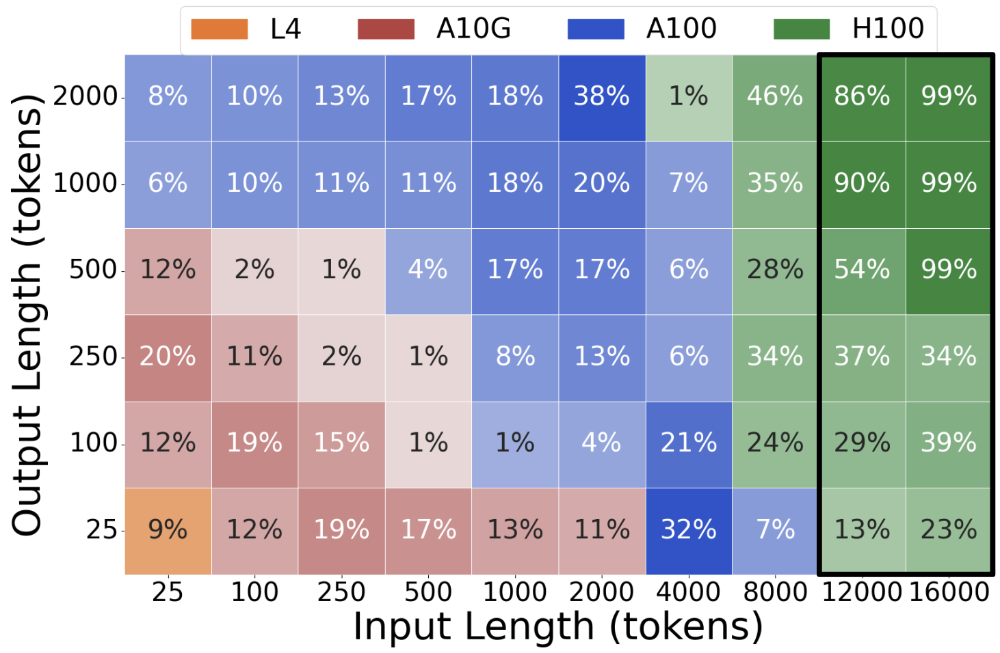
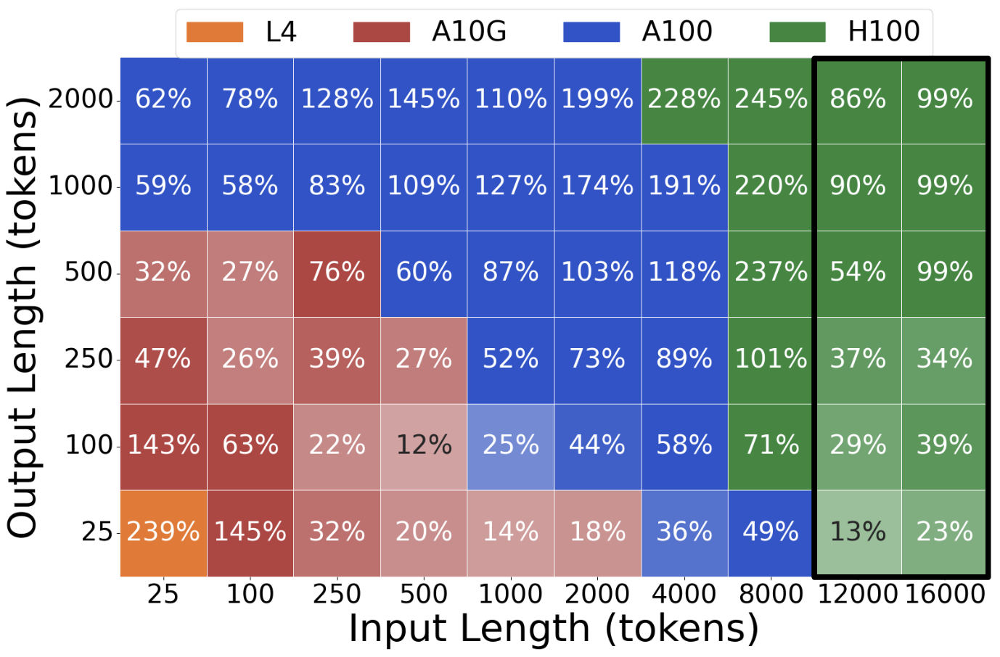
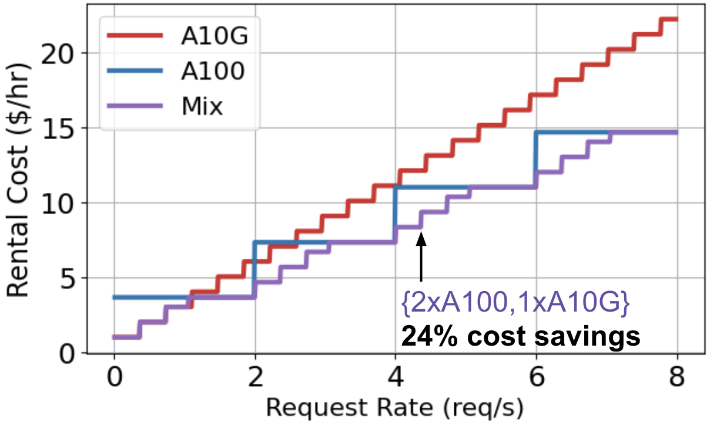
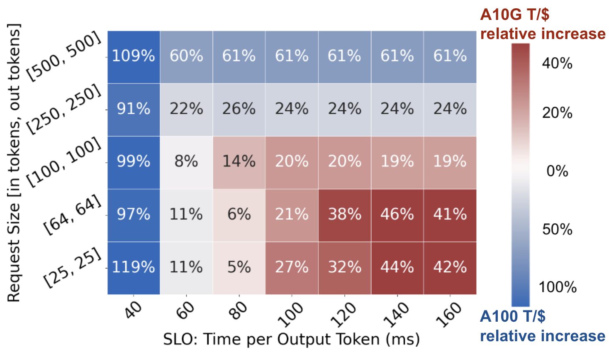
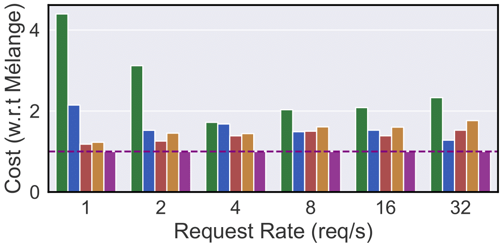
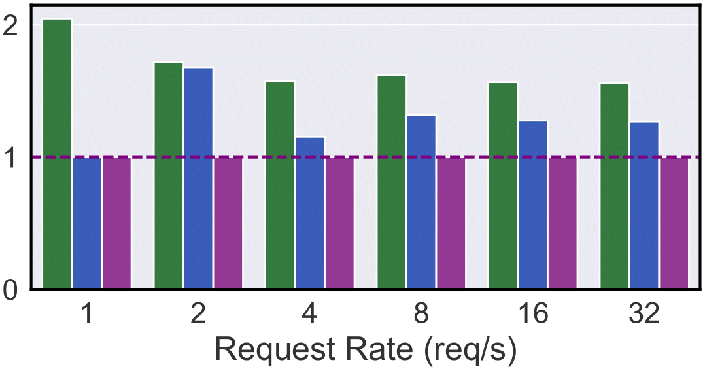

# Exploiting Heterogeneous GPUs to Cut LLM Deployment Costs

*This blog is based on our preprint "Mélange: Cost Efficient Large Language Model Serving by Exploiting GPU Heterogeneity". For more details, see the* <a href="https://arxiv.org/abs/2404.14527" target="_blank">*preprint on arXiv*</a>.

### TL;DR
Using an optimal *mix* of GPU types in your LLM deployment can significantly cut deployment costs by exploiting differing GPU cost efficiencies across diverse LLM service scenarios.

## The High Cost of LLM Deployment

Large language models (LLMs) are increasingly integrated into many online services such as search engines and virtual assistants. However, the deployment of these models is often cost-prohibitive due to the need for expensive GPU resources. 

Many prior works reduce deployment costs by increasing inference engine performance, but our study shifts the spotlight to choosing the most cost-effective GPU type(s) for any given LLM service.

## GPU Heterogeneity to the Rescue

There is a large and growing option space of AI hardware accelerators, from NVIDIA GPUs and AMD GPUs to Google TPUs, AWS Inferentia, and more. Within these options, *higher cost does not always lead to higher performance*. We find, instead, that the cost efficiency of a given GPU is heavily influenced by three key characteristics of LLM services: request sizes, request rates, and service-level objectives (SLOs).

Whereas most LLM service deployments use only a single GPU type to host model replicas, we show that a *mix* of heterogeneous GPUs, tailored to the specific characteristics of a given LLM service, can lead to significant cost savings. 

<!-- Building on this analysis, we introduce **Mélange**, a framework designed to optimize GPU allocation by leveraging the diversity of GPU types. Mélange navigates GPU heterogeneity and formulates GPU allocation as a cost-aware bin-packing problem, efficiently matching service requirements with the most suitable and economical GPU configuration, which is often a mix of GPU types. -->

# Key Factors Influencing GPU Cost Efficiency

In this section, we highlight the three key LLM service characteristics that influence GPU cost efficiency: **request size**, **request rate**, and **SLO**.

## Request Size

<!-- The size of each request, which includes both input and output token lengths, significantly impacts GPU cost efficiency. Smaller request sizes tend to be more cost-effective on lower-end GPUs, achieving a higher number of tokens processed per dollar. Conversely, larger request sizes benefit from the greater processing power of high-end GPUs, making them more cost-efficient for such tasks. -->
To demonstrate the effect of LLM request size (input and output lengths) on GPU cost efficiency, we illustrate three case studies. In each case, we measure the maximum generation throughput each GPU type achieves across a range of request sizes, and divide the throughput by the GPU's on-demand rental cost, resulting in a measure of cost efficiency (tokens/\\$, or T/\\$). In each plot, a tile's shade indicates which GPU is most cost effective and the tile's value indicates the percent increase of cost efficiency relative to the less cost efficient GPU.

* **Llama2-7b on A100 and A10G:** In Plot 1, for small requests, A10G achieves up to 72% greater cost efficiency. Conversely, as the request size increases, A100 demonstrates 38% greater cost efficiency.

* **Llama2-70b on L4, A10G, A100, and H100 serving:** We extend the study to include L4 and H100. Plot 3 compares the best GPU to the second best, and Plot 4 compares the best to the worst. In the black boxes, only A100 and H100 are compared. Note that, across the large request size spectrum, there are regions where each of the four GPU types is most cost effective.

* **Llama2-70b on 2xH100 and 2xA100:** In Plot 2, we also examine a tensor parallel setting (2 H100s and 2 A100s) and observe similar trends. The cheaper GPU (A100) achieves higher cost efficiency for smaller requests, while the higher-end GPU (H100) excels for large request sizes.

**Takeaways:** There is no universally most cost-efficient GPU for a given LLM. Instead, GPU cost efficiency is highly dependent on request sizes. Lower-end GPUs are more cost-effective for small request sizes whereas higher-end GPUs are best for large request sizes.

<!-- TODO: drop shadow on the plot -->

  

    
    
Plot 1: Llama2-7b on A10G, A100

  

  

    
    
Plot 2: Llama2-70b on 2xH100, 2xA100

  

  

    
    
Plot 3: Best GPU vs 2nd Best GPU

  

  

    
    
Plot 4: Best GPU vs Worst GPU

  

## Request Rate

Consider serving Llama2-7b across varying request rates with three different GPU allocation policies: A10G-only, A100-only, or a mix of both. Plot 5 depicts the on-demand rental cost of serving a range of traffic volume with these policies. At low rates, A10G is the cheapest choice, then A100 becomes the economic option for higher rates. However, using a mix of A10G and A100s permits finer-grained scaling and consistently leads to the lowest cost.

In general, at low request rates, services can save costs by right-sizing down from expensive, high-end GPUs to more affordable, lower-end GPUs. Further, even at high request rates, a mix of GPU types can be used to more closely match demand, optimizing GPU utilization and reducing resource waste.

**Takeaway:** Mixing heterogeneous GPU types permits a finer-grained approach to resource scaling, which better aligns provisioned resources with workload demand.

  

    
    
Plot 5: Llama2-7b on A10G and A100 across rates

  

  

    
    
Plot 6: Llama2-7b on A10G and A100 across TPOT SLOs and request sizes

  

## Service-Level Objectives (SLOs)
Services typically establish latency-based service-level objectives to define the performance standards that a service must meet. High-end GPUs are essential for stringent SLOs due to their lower latency and higher throughput. However, for services with more relaxed SLOs, lower-end GPUs can be used effectively to cut costs while still meeting performance expectations.

In Plot 6, we compare the cost efficiency (tokens/\\$, or T/\\$) of A10G and A100 serving Llama2-7b at a range of request rates and Time Per Output Token (TPOT) SLOs. A modification to the TPOT SLO shifts the boundary within the request size space between which A10G or A100 are most cost effective, and significantly influences the magnitude of cost efficiency differences between the GPUs. As a result, both request size and SLO must be considered in tandem when determining cost efficiency.

**Takeaway:** While strict SLOs require expensive high-performance GPUs, lower-end GPUs can be used to cut deployment costs in loose-SLO scenarios.

# Mélange

*The Mélange Framework*

Building on this analysis, we introduce **Mélange**, a GPU allocation framework that derives the minimal-cost GPU allocation for a given LLM service. 

In Mélange, each GPU type (1a) passes through a one-time offline profiling step (2) to measure GPU performance across request sizes and rates. Then, given the profiling results and an LLM service definition (1b), Mélange’s objective is to choose a GPU allocation for the service workload that minimizes cost. To do so, we frame the allocation task as a cost-aware bin packing problem, where bins are GPUs and items are slices of the workload. We formulate the problem as an integer linear program (ILP) and efficiently solve with an off-the-shelf solver (3). Upon solution, Mélange produces the GPU allocation that can serve the LLM service at minimal cost while adhering to the service SLO (4).

Mélange’s strength stems from two key properties. First, it is *heterogeneity-aware*. Mélange’s profiling and ILP formulation account for the large diversity of GPU types and LLM services, enabling efficient navigation of heterogeneous GPU types given a service specification. Second, Mélange is *flexible*. The inputs (1a, 1b) can be flexibly modified to include new generations of GPUs or alternative definitions of SLO, ensuring Mélange is effective for diverse services.

# Experimental Results

We evaluated Mélange's performance using various GPU types (NVIDIA L4, A10G, A100, and H100), model sizes (Llama2-7b and Llama2-70b), and TPOT SLOs (40ms, 120ms). To capture a range of service scenarios, we use three datasets in evaluations: Chatbot Arena [dataset](https://huggingface.co/datasets/lmsys/lmsys-chat-1m) for short-context tasks, Pubmed [dataset](https://huggingface.co/datasets/ccdv/pubmed-summarization) for long-contex tasks, and a synthetic blend of the two datasets for a mixed-context setting. We compare against baselines that use only a single GPU type. Our results indicate substantial cost reductions in diverse service settings:

  

    
    
Plot 7: Short-context, 120ms TPOT SLO

  

  

    
    
Plot 8: Short-context, 40ms TPOT SLO

  

**Short-Context Tasks (Interactive Chats):** In Plots 7 & 8, Mélange achieves 15-77% cost reduction (120ms SLO) and 9-68% reduction (40ms SLO) compared to single-GPU strategies. At 1-2 req/s, H100/A100 are underutilized, making L4/A10G the economic option.. However, as the rate increases, L4/A10G’s cost advantage reduces as A100/H100 are better utilized, yet they remain competitive with A100 even at higher request rates due to their T/\\$ advantage for smaller request sizes. Conversely, at a 40ms SLO, A10G/L4 show much higher relative costs due to their increased latency, requiring more instances to meet the tight deadline. Mélange adapts by allocating more L4/A10G at 120ms SLO and more A100 at 40ms SLO, consistently reducing overall cost.

  

    
    
Plot 9: Long-context, 120ms TPOT SLO

  

  

    
    
Plot 10: Long-context, 40ms TPOT SLO

  

**Long-Context Tasks (Document Summarization):** In Plots 9 & 10, Mélange achieves 15-33% cost reduction (120ms SLO) and 2-22% reduction (40ms SLO). A100 generally achieves higher T/\\$ for the request sizes in PubMed, evidenced by the 120ms setting where A100-only is consistently cheaper than H100-only. However, when SLO tightens to 40ms, H100 is the clear winner due to H100’s lower inference latency. Again, Mélange adapts to these dynamics by allocating a greater share of A100s at a looser SLO, and more H100s as the SLO is tightened.

  

    
    
Plot 11: Mixed-context, 120ms TPOT SLO

  

  

    
    
Plot 12: Mixed-context, 40ms TPOT SLO

  

**Mixed-Context Tasks (Chat with Documents):** In Plots 11 & 12, Mélange achieves 13-51% cost reduction (120ms SLO) and 4-51% reduction (40ms SLO). Compared to the PubMed workload, A100-only has much greater cost efficiency in the Mixed workload than H100 due to a greater portion of short-context requests, for which A100 achieves greater T/\\$. Mélange capitalizes by using more A100 than H100, but it also uses L4/A10Gs for small requests, enabling even further cost reduction.

The results validate the core observations that request size, request rate, and SLOs jointly determine GPU cost efficiency. As any of these LLM service characteristics vary, Mélange flexibly adjusts its GPU allocation and mixes GPU types to exploit their heterogeneity. This consistently delivers the most cost efficient allocation, achieving up to a 77% cost reduction.

# Conclusion

Within the large and growing option space of AI hardware accelerators, there is significant opportunity to exploit their heterogeneity to cut LLM serving costs. By allocating a mix of GPU types tailored to a given LLM service, Mélange offers an efficient solution for reducing LLM deployment costs while ensuring service quality remains uncompromised.

*For more details, see the [preprint on Arxiv](https://arxiv.org/abs/2404.14527).*